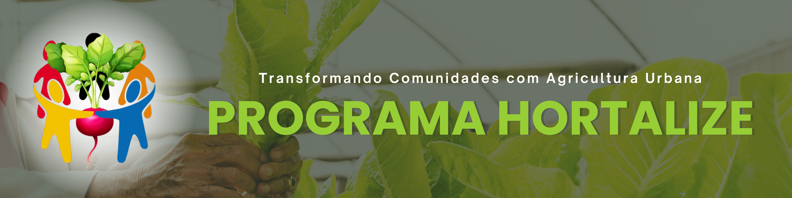

# 🌱 Programa Hortalize

 

## 🏷️ Badges

 

## 📑 Índice

- [Descrição do Projeto](#descrição-do-projeto)
- [Status do Projeto](#status-do-projeto)
- [Impacto Social](#impacto-social)
- [Acesso ao Projeto](#acesso-ao-projeto)
- [Tecnologias Utilizadas](#tecnologias-utilizadas)
- [Desenvolvedoras](#desenvolvedoras)

 

## 📖 Descrição do Projeto

A ideia do Programa Hortalize é transformar terrenos baldios em hortas comunitárias, promovendo segurança alimentar, inclusão social e geração de renda. A iniciativa permite que os alimentos cultivados sejam consumidos pelos participantes, doados a famílias em situação de vulnerabilidade ou comercializados em feiras locais. 
Além disso, oferece capacitação técnica em agricultura urbana, fortalecendo a autonomia financeira e a sustentabilidade. O projeto também contribui para a revitalização de espaços urbanos ociosos, a redução da fome e o fortalecimento da economia solidária, impactando positivamente tanto a comunidade quanto o meio ambiente.

 

## 🚧 Status do Projeto

> **Em desenvolvimento**  
Atualmente na fase de implementação de **HTML e CSS**, conforme exigência da disciplina de Front-End.  
A próxima etapa será a aplicação de **JavaScript**.

 

## 🤝 Impacto Social

O projeto fortalece a comunidade, proporciona autonomia, renda e contribui, principalmente, para o cumprimento do segundo dos Objetivos de Desenvolvimento Sustentável (ODS) mas atende à outros também.

### ODS Contribuintes:
1. Erradicação da Pobreza
2. **Fome Zero e Agricultura Sustentável**
3. Saúde e Bem-Estar
8. Trabalho Decente e Crescimento Econômico
10. Redução das Desigualdades
11. Cidades e Comunidades Sustentáveis
12. Consumo e Produção Responsáveis
17. Parcerias e Meios de Implementação

 

  
  
  
  
  
  
  
  

 

## 🌐 Acesso ao Projeto

Acesse as telas desenvolvidas diretamente pelos links abaixo:

| Tela        | Link                                       |
|-------------|--------------------------------------------|
| Principal   | [inicial.html](./inicial.html)         |
| Cadastro    | [index.html](./index.html)           |
| Login       | [login.html](./login.html)                 |

 

## 💻 Tecnologias Utilizadas

- HTML5
- CSS3

 

## 👩‍💻 Desenvolvedoras

- [Josiane Mariane Batista](https://josibatista.github.io/web-front-end/)
- [Maria Clara Nascimento](https://mariandj.github.io/Programa-o-Web-Front-End/)

 

